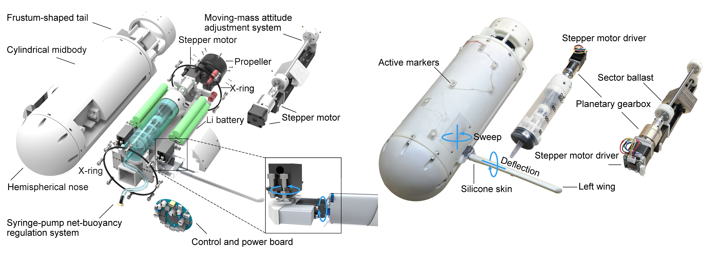
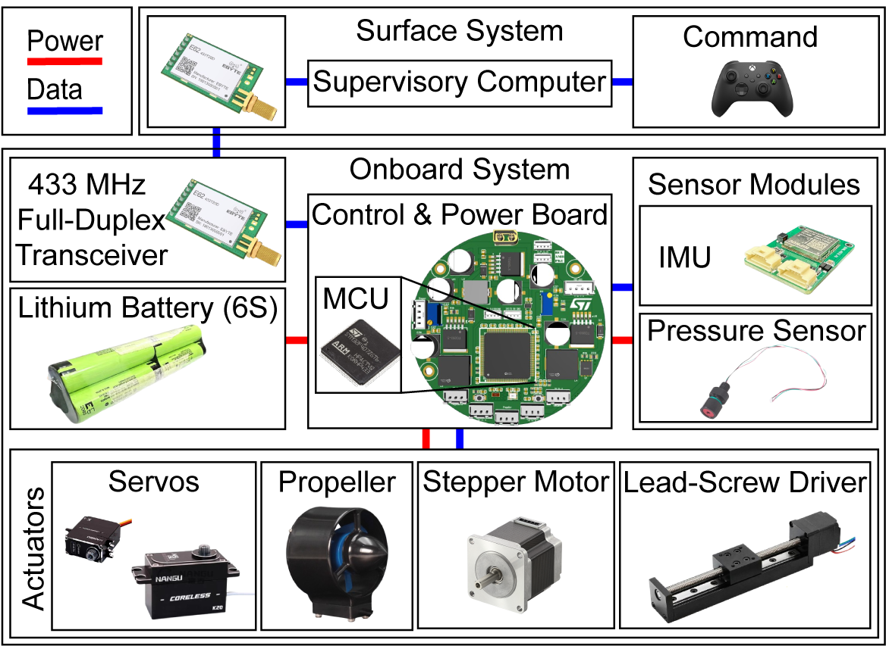
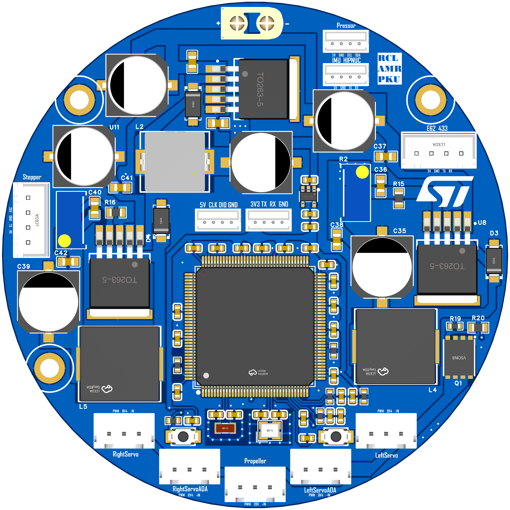
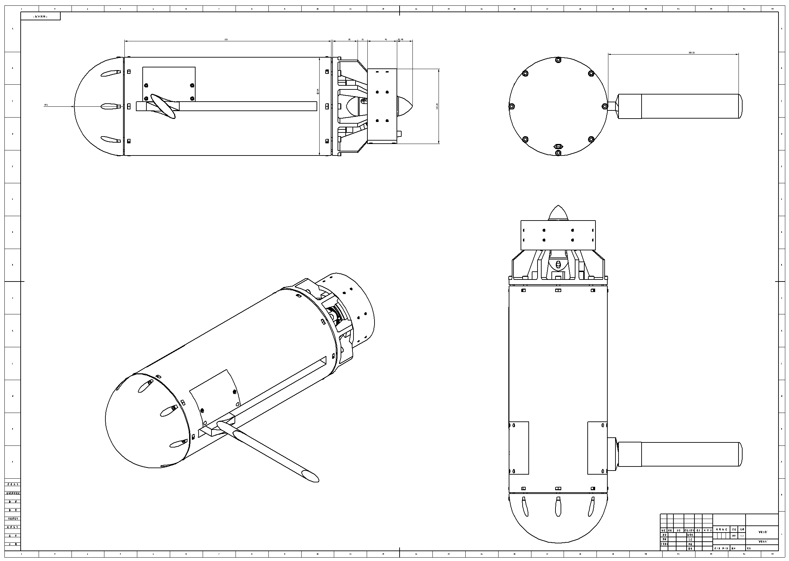

# FoDeGlider

FoDeGlider is a miniature hybrid underwater glider equipped with two independently actuated wings that support large-range folding and deflection. This repository accompanies the FoDeGlider research project and brings together the motion-capture datasets, model-identification code, mechanical design files, electronics, embedded firmware, and operator-interface documentation needed to study and reproduce the platform.

<p align="center">
  
</p>

<p align="center">
  <sub>Overview of the FoDeGlider platform and its principal components.</sub>
</p>

## System Overview

<table>
  <tr>
    <td width="70%" align="center">
      
      <br>
      <sub>Electrical architecture and onboard system connections.</sub>
    </td>
    <td width="30%" align="center">
      
      <br>
      <sub>Printed circuit board for the embedded electronic system.</sub>
    </td>
  </tr>
</table>

<table>
  <tr>
    <td width="50%" align="center">
      
      <br>
      <sub>Three-view drawing of the prototype, with the left wing fully deployed and the right wing fully folded.</sub>
    </td>
    <td width="50%" align="center">
      
      <br>
      <sub>Experimental demonstration of wing-assisted narrow-gap traversal in a confined environment.</sub>
    </td>
  </tr>
</table>

<p align="center">
  
  <br>
  <sub>Xbox control mapping for operating FoDeGlider.</sub>
</p>

## Repository Contents

```text
FoDeGlider/
|-- assets/                           # Images and media used in this README
|-- code/
|   |-- identification/               # Stage A-E model-identification programs
|   |-- evaluation/                   # Evaluation studies
|   |-- run_scripts/                  # .sh files for the identification stages
|   `-- requirements.txt              # Python dependencies
|-- config/                           # Normalization and physical-parameter files
|-- data/
|   |-- raw_mocap_csv/                # Raw motion-capture measurements
|   `-- processed_mocap/stage_a_to_e/ # Processed data
|-- electronics/                      # Electrical architecture and PCB design files
|-- hardware/                         # Mechanical drawings and printable STL models
`-- software/                         # Embedded firmware and control documentation
```

## Model Identification

The identification is organized into five sequential stages. The scripts in `code/run_scripts/` run the corresponding files in `code/identification/`. Generated result JSON files are passed from one stage to the next through the `INPUT_*_JSON` environment variables defined by the run scripts.

The evaluation programs support comparisons between the full multibody model and the `single_rigid_body`, `no_force_scale`, `no_torque_scale`, `no_add_mass_scale`, and `no_add_inertia_scale` variants:

- `code/evaluation/multi_vs_single.py` produces `multi_vs_single_summary.csv`.

- `code/evaluation/scale_ablation.py` produces `scale_ablation_summary.csv`.

Both summaries report the mean and median normalized mean-squared error at the window and trajectory levels.

## Dataset

The repository contains both raw motion-capture CSV files and processed data files used by the identification pipeline.

## Firmware

The embedded firmware is located in `software/firmware/FoDeGlider/`. The project includes an STM32CubeMX configuration and a Keil MDK-ARM project.

## Citation

If you use FoDeGlider, its datasets, or its model-identification code in your research, please cite the associated paper. Full citation information will be added upon publication.
